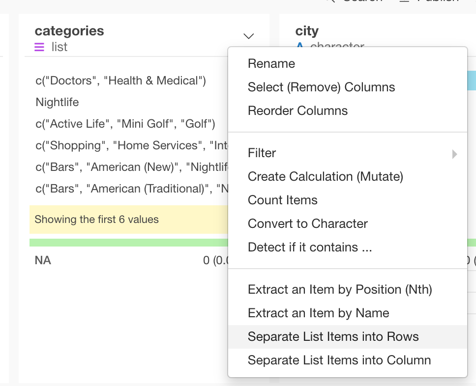
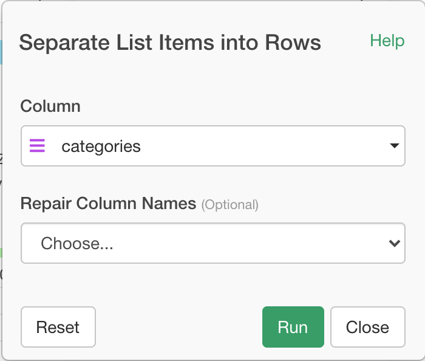

# Separate List Items into Rows (Unnest Longer)

Unnest a list column or a list of data frames by making each element of the list to be presented in its own row.

## How to Access This Feature

You can access it from column menu of list columns.

## Separate List Items into Columns (Unnest Wider)

* Column - List column to unnest.
* Repair Column Names (Optional) - The default is Unique Without Empty.

  * Override: Override existing column if resulting column name conflicts with existing one.
  * Unique without Empty: Make sure resulting column names are unique and not empty,
  * Unique without Special Characters: Make sure resulting column names are unique and do not have special characters.
